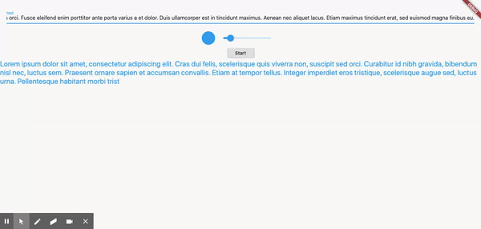

[](https://pub.dev/packages/animated_typing)

**Usage**:

- Add the package to the dependencies:
```yaml
dependencies:
  ...
  animated_typing: any
```
- Import it
```dart
import 'package:animated_typing/animated_typing.dart';
```

- USe the widget pass text, duration, and/or style:

```dart
AnimatedTyping(
  text: 'This text will be animated while typing',
  duration: Duration(
    seconds: 3,
  ),
  style: TextStyle(
    color: Colors.red,
    fontSize: 22,
  ),
),
```
